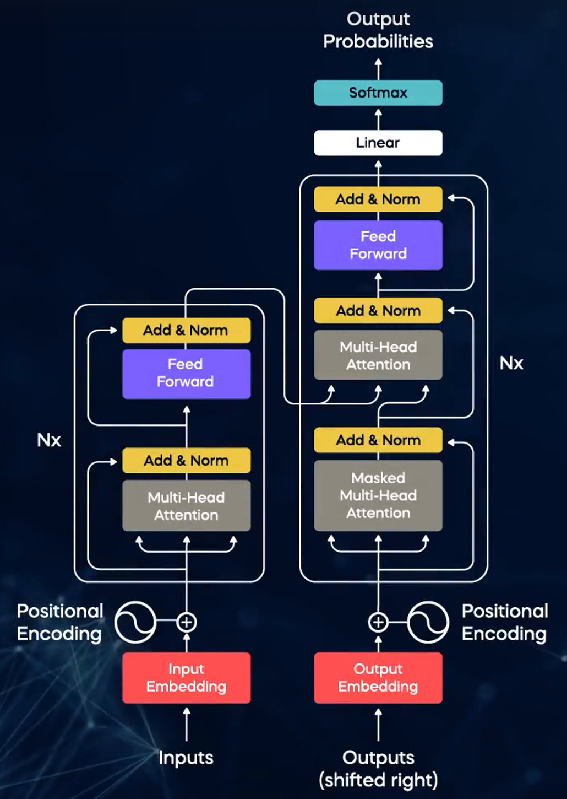
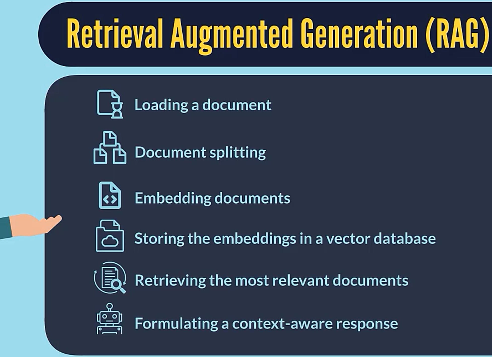
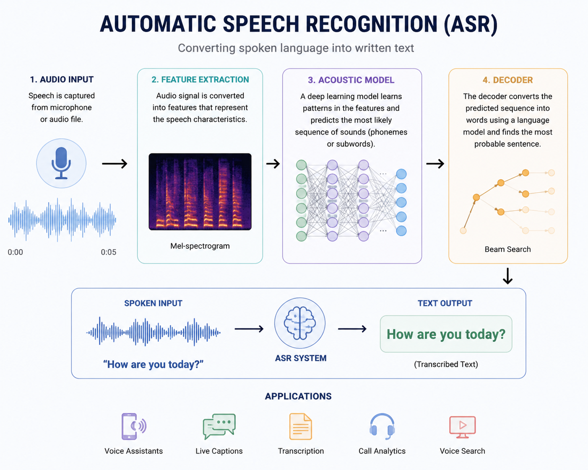
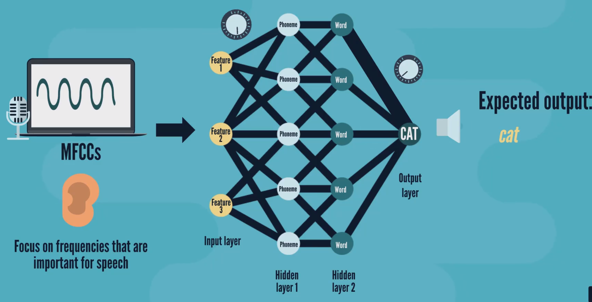

# Transformer Architecture

<p align="center">
  
</p>

<br>

## 1. Overview

The Transformer is a sequence-to-sequence model that processes input data in parallel using attention mechanisms instead of recurrence

A Transformer models:

```
P(y_t | y_{<t}, x)
```
<br>

## 2. Embedding Phase

### Tokenization

Input sentence tokens:

```
[I, love, AI]
```

### Input Embedding

> Each token is mapped to a vector using a learned embedding matrix:

```
E ∈ ℝ^(vocab_size × d_model)
```

Input:
```
X ∈ ℝ^{n × d_model}
```
- n = number of tokens

- d_model = length of embedding vector

### Positional Encoding

> Adds order information to tokens

```
PE(pos, 2i)   = sin(pos / 10000^(2i / d_model))
PE(pos, 2i+1) = cos(pos / 10000^(2i / d_model))
```

Final input:

```
X = X_embed + X_pos
```
<br>

## 3. Encoder

> Nx encoder layers are stacked where each encoder is fed output from the previous encoder as input

> Encoder processes the full input sequence in parallel to build contextual representations

### 3.1 Self-Attention

> Captures relationships between input tokens

> Each token looks at all other tokens and decides what is relevant

```
Q = X W_Q
K = X W_K
V = X W_V
```

Shapes:

```
X ∈ ℝ^{n × d_model}
W_Q, W_K, W_V ∈ ℝ^{d_model × d_k}
```

```
Attention(Q, K, V) = softmax(QK^T / √d_k) V
```

- Output becomes context-aware

### 3.2 Multi-Head Attention

> Learns multiple relationships simultaneously

> Each head captures a different relationship (semantics, grammar, syntax, etc.)

```
head_i = Attention(X W_Q^i, X W_K^i, X W_V^i)
```

```
MultiHead = Concat(head_1, ..., head_h) W_O
```

```
W_O ∈ ℝ^{h·d_k × d_model}
```
- d_model = h * d_k

### 3.3 Add & Norm

```
X = LayerNorm(X + MultiHead(X))
```

- Adding to input fed at the previous layer prevents vanishing gradients

- LayerNorm stabilizes training

- LayerNorm has 2 learnable parameters (γ, β)

### 3.4 Feed Forward Network (FFN)
> Processes each token independently to refine features

> Projects to higher dimensional space (to learn representations of each token) then back to original

```
FFN(X) = σ(X W1 + b1) W2 + b2
```

```
W_1 ∈ ℝ^{d_model × d_ff}
W_2 ∈ ℝ^{d_ff × d_model}
```

- Usually, d_ff = 4 * d_model

- Applied independently to each token

- Adds non-linearity

### 3.5 Add & Norm

```
Enc_out = LayerNorm(X + FFN(X))
```

<br>

## 4. Decoder

> Nx decoder layers are stacked where each decoder is fed output from the previous decoder as input

> During training phase, decoder is fed the target sentence (shifted right i.e. `<end>` token is removed) and next token prediction for each token runs in parallel

> During inference phase, decoder generates next token one step at a time using previously generated tokens and encoder context

Decoder has two attention mechanisms:
- Masked Self-Attention (output → output)

- Cross Attention (output → input)

### 4.1 Masked Self-Attention

> Prevents access to future tokens

```
Q = X_dec W_Q
K = X_dec W_K
V = X_dec W_V
```

```
Mask (M): [0  -∞ -∞]
          [0   0 -∞]
          [0   0  0]
```

```
Attention = softmax((QK^T + M) / √d_k) V
```

### 4.2 Add & Norm

```
X = LayerNorm(X + FFN(X))
```

### 4.3 Cross Attention

> Helps learn relationship between input and output

```
Q = X_dec W_Q
K = Enc_out W_K
V = Enc_out W_V
```

```
Attention = softmax(QK^T / √d_k) V
```

### 4.4 Add & Norm

```
X = LayerNorm(X + FFN(X))
```

### 4.5 Feed Forward Network

```
FFN(X) = σ(X W_1 + b_1) W_2 + b_2
```

### 4.6 Add & Norm

```
Z = LayerNorm(X + FFN(X))
```
<br>

## 5. Output Layer

```
Logits = Z W + b
```

```
Z ∈ ℝ^{n × d_model}

W ∈ ℝ^{d_model × vocab_size}
```

```
P = softmax(Logits)
```

- Converts to probability distribution over vocabulary

<br>

## 6. Training Phase

> Next token prediction in training phase is not autoregressive — everything runs in parallel

> It is because we already know the next token and we only need to compute the loss between predicted and actual output

Objective (Minimize):

```
L = -∑ log P(y_t | y_<t, x)
```

- Model learns next-token prediction

<br>

## 7. Inference Phase

> This phase is autoregressive

Steps:
- Start with `<start>`

- Predict next token

- Append token

- Repeat

- Stop at `<end>`

<br>

## 8. KV Caching

> For masked self attention, compute Q for the new token and append only new K, V (K, V for previous tokens remain unchanged)

> For cross-attention, K and V are computed once and reused for all steps

At step t:

```
Q ∈ ℝ^{1 × d_k}
K, V ∈ ℝ^{t-1 × d_k}
```

Append:

```
K = [K; k_t]
V = [V; v_t]
```

- Reduces complexity from O(n²) → O(n)

<br>

## 9. Beam Search

> Chooses top_k next token predictions at each step

> At the end, selects best sentence based on final score

Score:

```
Score = sum(log probabilities) / length^α
```

- length^α is used to reduce the impact of sentence length on the final Score

- This is because, longer sentences can have higher value of sum(log probabilities) 


<hr style="height:5px; border:none; color:#333; background-color:#333;">

<br>
<br>
<br>

# Special Tokens

> Special tokens are predefined tokens added to the input sequence to guide the transformer’s behavior for specific tasks

> Special tokens keeps the input consistent and helps the transformer understand the input structure

<br>

## CLS (Classification Token) 
> Placed at the beginning of the input sequence

- Represents the entire sequence

- Final hidden state of this token is used for classification tasks  

Example: <br>
[CLS] I love AI


Used in:
- Text classification

- Sentiment analysis  

<br>

## SEP (Separator Token) 
> Used to separate different segments of text  

Example: <br>
[CLS] Sentence A [SEP] Sentence B [SEP]


Used in:
- Sentence pair classification  

- Question answering  

<br>

## PAD (Padding Token)
> Used to make all sequences in a batch the same length  

- Ensures efficient parallel processing  

- Ignored during attention using masking  

Example: <br>
[I, love, AI, PAD, PAD]

<br>

## Truncation
> Cuts longer sequences to a fixed maximum length  

- Prevents memory overflow  

- Ensures consistent input size  

<br>

## MASK Token
> Used in masked language modeling (MLM)  

- Model predicts the masked word using context  

Example: <br>
I love [MASK] life


Used in: Pretraining models like BERT  

<br>

## Task-Specific Tokens

> Custom tokens introduced for specific tasks  

Examples: <br>
[SOURCE] Hello [TARGET] Bonjour


- Helps model distinguish different roles in input  

- Common in:

  - Machine translation  

  - Instruction tuning  
  
  - Multi-task learning  

<hr style="height:5px; border:none; color:#333; background-color:#333;">

<br>
<br>
<br>

# Retrieval-Augmented Generation (RAG)

<p align="center">
  
</p>

<br>

## 1. Overview

- RAG enhances LLMs by incorporating external knowledge during inference  

- Instead of relying only on pre-trained knowledge, the model retrieves relevant information and uses it to generate grounded responses  

<br>

## 2. Pipeline

RAG consists of three main stages:

### 2.1 Indexing

> Preprocessing and storing data in a form suitable for efficient retrieval

Steps:

- Load raw documents (PDFs, text, repositories, etc.)

- Split documents into chunks

- Convert chunks into embeddings

- Store embeddings in a vector database (FAISS, Chroma, etc.)

Key points:

- Chunk size impacts retrieval quality  

- Overlapping chunks help preserve context  

- Good embeddings are critical for semantic search  


### 2.2 Retrieval

> Responsible for fetching the most relevant and **diverse** chunks of data

Steps:

- Convert user query into embeddings  

- Search in a vector database (FAISS, Chroma, etc.)  

- Retrieve top-k relevant documents  

Key points:

- Relevance is important  

- **Diversity is equally important**  

- Each chunk should contribute **new information**


### 2.3 Augmented Generation

> Combines retrieved context with user query and feeds it to the LLM

Final Prompt = User Query + Retrieved Context

- LLM generates response using both query and retrieved data  

- Produces context-aware and grounded outputs  

<br>

## 3. Advantages

- Not resource-heavy (compared to fine-tuning)  

- No need to pass entire dataset in the prompt  

- Reduces hallucinations by grounding responses  

<br>

## 4. Drawbacks

- Increased latency due to real-time retrieval  

- Quality of retrieved docs influences the model's response  

<hr style="height:5px; border:none; color:#333; background-color:#333;">

<br>
<br>
<br>

# Speech Recognition (ASR)

<p align="center">
  
</p>

<br>

## 1. Overview

> Automatic Speech Recognition (ASR) converts spoken audio into text

**Phoneme**: the smallest unit of sound that distinguishes one word from another

Pipeline:

```
Audio Signal Processing -> Feature Extraction -> Acoustic Modeling -> Language Modeling -> Decoding -> Text
```

<br>

## 2. Audio Signal Processing

### 2.1 Signal Capture

> A microphone converts acoustic (sound) waves in the environment into an analog electrical signal

### 2.2 Analog-to-Digital Conversion (ADC)

> Converts the analog signal into a digital signal so machines can store and process it easily

**Sampling**

> Multiple snapshots of the audio waveform are taken at fixed intervals

- Each sample captures the amplitude (loudness) of the sound at that specific moment

- More samples per second (higher sampling rate) → better quality (e.g. 16 kHz is common for speech, 44.1 kHz for music)

**Quantization**

> Each sample's amplitude value is rounded off to the nearest of a fixed set of levels

- More levels → better quality, less quantization error

### 2.3 Framing

> Grouping consecutive samples into small, overlapping chunks

- Framing is needed because a single sample is too short to be meaningful on its own

- Chunks (frames) need to be long enough to capture patterns and features

```
Frame 1: samples 1   - 128
Frame 2: samples 64  - 192
Frame 3: samples 128 - 256
```

- Frames overlap to help ensure no detail is lost at frame boundaries

### 2.4 Preprocessing

- **Noise reduction**: removes background noise — however, models also need to learn to recognize speech in noisy environments, so a balance is needed between cleaning the signal and preserving realistic variation

- **Normalization**: adjusts signal levels to maintain consistency across different audio samples

- **Resampling**: changes the sample rate of an audio signal to match the requirements of an ML model, or to combine datasets recorded at different rates

- **Data Augmentation**: used when data is limited — creates new audio samples from existing ones by applying transformations (e.g. pitch shift, time-stretch, added noise)

- **Segmentation (Voice Activity Detection)**: identifies and isolates the sections of audio where speech is present

- **Compression**: reduces audio data size while preserving as much of the original quality as possible

<br>

## 3. Feature Extraction

> Converts preprocessed audio into a compact set of numbers that highlight the properties most relevant to recognizing speech

Key audio features: **pitch, loudness, rhythm, timbre**

### 3.1 Time Domain

> Features extracted directly from the raw audio waveform

- Captures volume/amplitude fluctuations over time

- Helps identify the start, stop, and loudness variations of speech

### 3.2 Frequency Domain

> Captures the different tones and frequencies present in the audio

- Useful for distinguishing vowels, consonants, and pitch

### 3.3 Time-Frequency Domain

> Captures how the signal's spectral (frequency) content changes over time

### 3.4 Fourier Transform

**Discrete Fourier Transform (DFT)**

> Converts a signal from the time domain to the frequency domain

- Helps identify which frequencies/components are present in the sound

- Does **not** reveal how those frequencies vary over time

**Short-Time Fourier Transform (STFT)**

> Applies the DFT to short, overlapping frames to show how frequencies vary over time

- Produces a spectrogram — shows which frequencies are present and when they appear

- Used to identify phonemes

### 3.5 MFCCs (Mel-Frequency Cepstral Coefficients)

> A compact feature representation designed to mimic human hearing

- Human ears are more sensitive to certain (mid-range) frequencies — we hear the frequency range where most speech happens much better than very high or very low frequencies

- The Mel scale warps frequency to reflect this sensitivity, so MFCCs emphasize the ranges that matter most for speech

- Enables the system to process sound more like the human auditory system does

- One of the most widely used feature sets fed into acoustic models

<br>

<p align="center">
  
</p>

<br>

## 4. Acoustic and Language Modeling

### 4.1 Acoustic Model

> Identifies phonemes — focuses on individual sounds in the audio

### 4.2 Language Model

> Uses individual phonemes/words to piece together whole words and sentences

- Estimates the likelihood of the possible word sequences that could be formed from the given phonemes and chooses the most probable one

- Uses context and grammar to make this selection (e.g. distinguishing "recognize speech" from "wreck a nice beach")

<br>

## 5. Acoustic Model Approaches

### 5.1 HMMs (Hidden Markov Models)

> A statistical model where each state represents a phoneme

- Models the probability of transitioning from one phoneme to the next, and the likelihood of certain observable features given a phoneme

- Predicts the next phoneme based only on the current one (the Markov assumption)

**Limitations**:

- Struggle with complex speech patterns — e.g. when speech speeds up or slows down — because they only consider the previous state, not the full sequence context

- Rely on hand-engineered features and typically pair with a separate language model

### 5.2 Deep Learning Approaches

> Simple statistical models look at each sound in isolation and don't consider order. Neural networks instead analyze how sounds relate to one another, helping them understand speaking rate, accent, context, and structure

- **CNNs**: can analyze spectrogram images to identify local patterns like phonemes and words

- **RNNs**: process audio sequentially, carrying a hidden state forward to capture context from previous time steps

- **LSTM**: an RNN variant with gating mechanisms that better retains long-range dependencies and reduces vanishing-gradient issues

- **Transformers**: handle the entire input sequence in parallel via self-attention
  - Audio segments are fed in → encoder learns patterns and features → decoder generates the output word sequence
  - Better accuracy and efficiency than RNNs/LSTMs
  - Can handle longer sequences and capture better long-range context

<br>

## 6. End-to-End Architectures

> Modern ASR systems increasingly replace the separate HMM + acoustic model + language model pipeline with a single neural network trained end-to-end on audio-to-text pairs

### 6.1 CTC (Connectionist Temporal Classification)

> A loss function that lets a model align variable-length audio input with a shorter text output, without needing frame-level alignment labels

- Introduces a special "blank" token to absorb repeated or non-informative frames

- Assumes each output step is conditionally independent of the others, which limits how well it models fluent language on its own

### 6.2 Encoder-Decoder (Attention-Based)

> Encoder processes the full audio sequence into contextual representations; decoder generates output tokens one at a time while attending back to the encoder output

- Not limited by CTC's independence assumption, since each output token is conditioned on previously generated tokens

- Basis for models like Whisper

### 6.3 RNN-T (RNN Transducer)

> Combines an audio encoder, a label (text) encoder that predicts the next token from previous tokens, and a joint network that combines both to predict the next output token

- Naturally supports streaming/online recognition, since it doesn't need to see the entire input before producing output — unlike standard encoder-decoder models

### 6.4 Whisper

> An encoder-decoder Transformer trained on large-scale, weakly-supervised, multilingual audio-text data

- A single model handles transcription, translation, and language identification

- Robust to noise, accents, and diverse audio conditions due to the scale and diversity of its training data

### 6.5 wav2vec 2.0

> A self-supervised model that learns speech representations from raw, unlabeled audio, then is fine-tuned on a small amount of labeled data

- Pretraining masks spans of the latent audio representation and trains the model to identify the correct masked segment via contrastive learning — conceptually similar to BERT's masked language modeling

- Significantly reduces the amount of labeled speech data needed to reach strong accuracy

<br>

## 7. Evaluation

**Word Error Rate (WER)**

> The standard metric used to measure ASR accuracy — compares the predicted transcript to the reference (ground-truth) transcript

```
WER = (S + D + I) / N
```

- S = substitutions, D = deletions, I = insertions (the edit operations needed to turn the prediction into the reference)

- N = number of words in the reference transcript

- Lower WER = better performance

**CER (Character Error Rate)**

> Same idea as WER, but computed over characters instead of words

```
CER = (S + D + I) / N
```

- S, D, I = substitution/deletion/insertion edits at the character level

- N = number of characters in the reference transcript

- Useful for languages without clear word boundaries (e.g. Mandarin, Japanese), and gives a more fine-grained signal than WER — a model can have a high WER but a low CER if it's making small, near-miss spelling errors rather than picking the wrong word entirely

